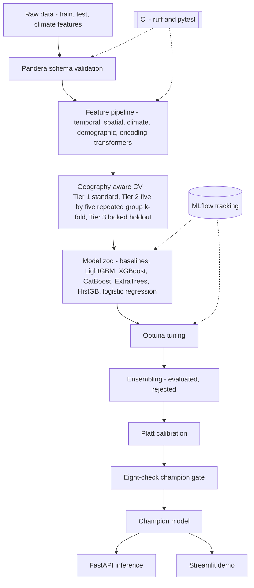
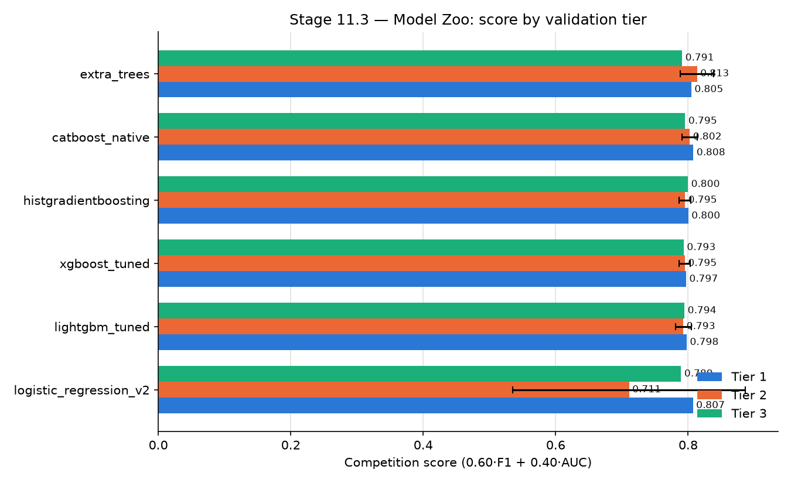
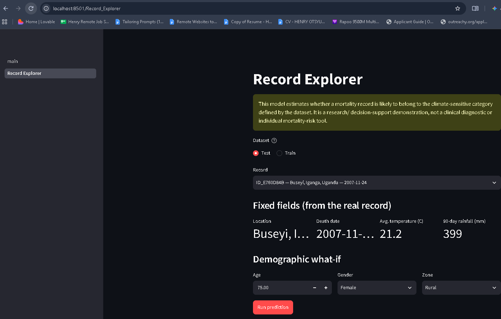
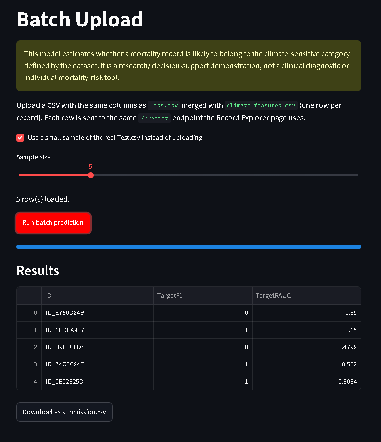

<div align="center">

# Climate-Sensitive Mortality Risk Prediction

**A validation-first ML system for predicting climate-sensitive mortality on locations it has never seen**


[](https://github.com/theerealhenry/climate-health-mortality-prediction/actions/workflows/ci.yml)


[TL;DR](#tldr) · [Problem](#problem-statement) · [Key Findings](#key-data-findings) · [Architecture](#architecture) · [Validation](#validation-strategy) · [Results](#results) · [Getting Started](#getting-started) · [Limitations](#responsible-ml--limitations)

</div>

---

## TL;DR

- **Problem:** predict whether a recorded death falls into a climate-sensitive category, using demographic, geographic, and climate/environmental data from a low-resource setting.
- **Core challenge:** every test-set location is geographically unseen during training, which breaks the usual random-split validation and demands a validation strategy built around that fact rather than around convenience.
- **Approach:** schema-validated data, a tested sklearn-compatible feature pipeline, a three-tier geography-aware cross-validation architecture, a model zoo compared under that architecture, Optuna tuning, an evaluated (and ultimately rejected) ensembling stage, and probability calibration — all logged in an experiment registry with a stated hypothesis per experiment.
- **Headline result:** the champion model (tuned CatBoost with Platt calibration) reaches 0.8156 (± 0.0198) under repeated geographic cross-validation and 0.831 on a fully unseen, external held-out evaluation set — the held-out score exceeded local CV, meaning no overfitting to validation.

## Problem statement

In low-resource settings, mortality outcomes are shaped by demographic vulnerability and environmental exposure together, not by biology alone. This project builds a supervised classifier that outputs, for each mortality record:

- a binary prediction of whether the death falls into a climate-sensitive category
- the predicted probability of that outcome

**Evaluation metric:** 0.6 × F1 + 0.4 × ROC-AUC, at a fixed 0.5 decision threshold (threshold tuning not allowed by design). A fixed threshold makes calibration a first-class concern rather than a nice-to-have: I can't tune my way to a good F1 score by hunting for a favorable cutoff, so the model's raw probabilities have to already be well-behaved around 0.5. That constraint shapes the model selection, calibration, and validation design throughout this repository.

Data: a public climate and health mortality dataset (~3,100 training records, single country).

## Key data findings

Verified directly against the raw data during forensics, not assumed — see `docs/PROJECT_BLUEPRINT.md` §0.1 and `docs/data_dictionary.md` for full methodology.

| Finding | Value | Why it matters |
|---|---|---|
| Train/test coordinate overlap | 0 of 43 training coordinates appear in test | Rules out random-split validation entirely; drives the geography-aware, multi-tier CV design |
| Train/test location-name overlap | 1 of 39 locations shared | Confirms the coordinate finding through an independent signal |
| Non-independent "twin" records | ~55 groups share identical place + death date (finer key), ~49 groups by location + date (~3% of training rows) | A second, distinct leakage mechanism, guarded against separately from geographic generalization |
| Strongest single predictor | `age`, r ≈ −0.44, ≈0.74 AUC alone | A real, strong signal consistent with known age-related vulnerability, not a leak |
| Target balance | 65% / 35% | Moderate imbalance; informs class weighting and calibration |
| Near-deterministic proxy for the target | None found | A mechanically derived target would show ≈0.95–0.99 AUC from a single feature; the actual ceiling is far below that |

## Architecture



The pipeline is linear and gated, not exploratory-notebook-driven: nothing is promoted to the next stage without passing the checks the previous stage defined. MLflow tracks every model-zoo run and every Optuna trial so results are reproducible without re-running the search. CI (ruff, black, and the full pytest suite, running on every push and pull request against main via GitHub Actions) is the mechanism meant to keep the feature pipeline and CV code honest as they change. The champion gate is deliberately the narrowest point in the diagram: many candidates enter, one leaves.

## Validation strategy

Random K-fold cross-validation looks fine on paper here and is wrong in practice: with zero coordinate overlap between train and test, a random split lets the model see nearby locations during training that it will never see at inference, which systematically overstates how well it generalizes. Three tiers are reported together for every candidate, not just one convenient number:

| Tier | Design | Purpose |
|---|---|---|
| Tier 1 | Standard stratified K-fold | A baseline reference number, known to be optimistic |
| Tier 2 | 5×5 repeated, group-based K-fold on geographic clusters | The primary generalization signal — repeated to get a mean and standard deviation across folds, not a single lucky (or unlucky) split |
| Tier 3 | A one-time locked holdout, spent once per candidate | An additional, independent check against overfitting to the Tier 2 loop itself |

The "twin" records — different individuals who died on the same day in the same place and therefore share identical climate features — are grouped explicitly so they never split across train and validation within a fold; this is a second, mechanically distinct risk from geographic generalization and is guarded separately (`docs/PROJECT_BLUEPRINT.md` §0.1). The Tier 3 holdout fold was locked before looking at any per-fold score, specifically to avoid picking a convenient split after the fact — the full reasoning is in [`docs/decisions/ADR-001-stage13-tuning-scope-and-holdout.md`](docs/decisions/ADR-001-stage13-tuning-scope-and-holdout.md).

## Results

Model comparison under the full three-tier CV (`docs/stage11_3_model_zoo_scorecard.csv`):

| Model | Tier 1 mean | Tier 2 mean ± std | Tier 3 score |
|---|---|---|---|
| CatBoost (native categoricals) | 0.808 | 0.802 ± 0.011 | 0.795 |
| Logistic regression | 0.807 | 0.711 ± 0.176 | 0.789 |
| Extra Trees | 0.805 | 0.813 ± 0.025 | 0.791 |
| HistGradientBoosting | 0.800 | 0.795 ± 0.009 | 0.800 |
| LightGBM (tuned) | 0.798 | 0.793 ± 0.012 | 0.794 |
| XGBoost (tuned) | 0.797 | 0.795 ± 0.009 | 0.793 |



Logistic regression is the clearest argument for this whole validation design: it scores 0.807 on Tier 1, competitive with everything else, then collapses to 0.711 ± 0.176 under geography-aware CV — a standard deviation nine times larger than the tree models'. A random-split evaluation would never have surfaced that instability; it's exactly the failure mode Tier 2 exists to catch.

**Champion: tuned CatBoost + Platt calibration.** Local repeated geographic CV: 0.8156 ± 0.0198. Score on a fully unseen, external held-out evaluation set: 0.831. The held-out score exceeded local CV rather than falling short of it, which is the direction that indicates the validation estimate was not overly optimistic.

### What didn't work

- **Ensembling.** Weighted averaging, out-of-fold stacking, and rank averaging were all evaluated against the tuned single model under the same repeated geographic CV. None beat the single model once re-checked across the full repeated-CV loop rather than a single fold split — the single tuned model was kept.
- **Additional feature experiments.** Three further engineered features, derived from the existing spatial and climate signal, were tested and rejected because they did not improve the Tier 2 mean without increasing its variance — the same standing decision rule applied to every experiment in this project (`docs/experiment_registry.md`).

Both are presented here as evidence the process worked, not as gaps: an experiment that is tested, found not to help, and left out is a completed piece of work, not a stalled one.

## Engineering practices

| Practice | Detail |
|---|---|
| Schema validation | `pandera` contracts for every raw file, enforcing dtypes, value ranges, categorical membership, ID uniqueness/pattern, and cross-field consistency checks; validated lazily so a bad file reports every violation at once |
| Feature transformers | sklearn-compatible (fit/transform), so training and inference share the exact same code path |
| Testing | 20 pytest files covering schemas, feature transformers, the CV splitter, model calibration, ensembling, and an environment smoke test |
| Experiment tracking | MLflow, SQLite-backed, from the first baseline onward |
| Hyperparameter tuning | Optuna, budgeted and scoped in a written ADR (`docs/decisions/`), not run ad hoc |
| Decision records | Architecture and process decisions recorded as ADRs, including alternatives considered and rejected |
| Experiment registry | Every experiment logged with its hypothesis, result, and decision (`docs/experiment_registry.md`) — including the rejected ones |
| Pre-commit | ruff, black, nbstripout, running against the project's own pinned tool versions |
| Pinned environments | `pyproject.toml` (dependency ranges) plus `requirements-lock.txt` (exact resolved versions) |

## Repository structure

```
├── configs/                  # YAML: paths, model hyperparameters, CV settings
├── data/
│   └── raw/                  # Train.csv, Test.csv, climate_features.csv
├── docs/
│   ├── PROJECT_BLUEPRINT.md  # full architecture and rationale
│   ├── data_dictionary.md
│   ├── experiment_registry.md
│   └── decisions/            # ADRs
├── notebooks/                 # research record - see notebooks/README.md
├── src/climate_health/
│   ├── data/                  # loading, pandera schema validation
│   ├── features/              # sklearn-compatible transformers
│   ├── models/                 # training, calibration, ensembling, inference
│   ├── evaluation/              # CV strategy, metrics
│   └── utils/
├── app/
│   ├── api/                    # FastAPI inference service (Stage 19.1)
│   └── streamlit_app/          # interactive demo (Stage 19.2)
├── tests/                      # pytest
├── submissions/                 # every generated prediction file, logged with its metadata
├── pyproject.toml               # dependencies (pinned ranges) + tool config
├── environment.yml              # conda bootstrap (Python 3.11 + pip)
└── requirements-lock.txt        # exact resolved versions
```

## Getting started

```bash
git clone https://github.com/theerealhenry/climate-health-mortality-prediction.git
cd climate-health-mortality-prediction

conda env create -f environment.yml
conda activate climate-health
pip install -e ".[all]"

pytest tests/test_environment_smoke.py -v   # verify the environment first
```

Common tasks (see `Makefile`):

```bash
make validate    # run pandera schema validation against the raw data
make lint        # ruff + black --check
make test        # full pytest suite
```

Generate predictions from the trained pipeline:

```bash
python -m climate_health.models.predict
```

Open the MLflow UI to inspect tracked runs:

```bash
mlflow ui --backend-store-uri sqlite:///mlflow.db
```

## Demo

Two ways to run the Phase 7 production build locally, in two terminals.

Terminal A — the inference API (Task 19.1):

```bash
uvicorn app.api.main:app
```

Terminal B — the Streamlit demo (Task 19.2), which calls that API rather than loading the model directly:

```bash
streamlit run app/streamlit_app/main.py
```

The demo has two pages. **Record Explorer** picks a real Train.csv/Test.csv record (real location, date, real climate values) and lets you change only the demographic fields — age, gender, zone — as a genuine what-if:



**Batch Upload** reproduces the actual submission pipeline over an uploaded CSV (or a sample of the real Test.csv), one row at a time through the same `/predict` endpoint, downloadable as a submission-shaped CSV:



## Releases

Two tags mean different things in this repository: `competition-submission-final` marks the exact commit submitted to the competition and is never moved or reused. Deployment releases (`v1.0.0`, `v1.1.0`, ...) are cut independently, whenever the production system (API, demo, deployment) has a stable state worth shipping — pushing one triggers `release.yml`: build the Docker image, test it against the built image, then deploy to the live Hugging Face Space. The two naming schemes are kept deliberately separate so a deployment release can never be mistaken for, or accidentally collide with, the frozen competition artifact.

## Responsible ML & limitations

This model estimates whether a mortality record is likely to belong to a climate-sensitive category as defined by this dataset. It is a research and methodology demonstration, **not a clinical or individual mortality-risk tool, and not validated for policy use.**

Concrete limits on what this project can support: ~3,100 training records from a single country, covering 39 distinct training locations over a multi-year span. Every test location is geographically unseen relative to training, which is precisely the condition the validation strategy is built around — but it also means the model's demonstrated generalization is to *a* new location within this dataset's geography, not to an arbitrary new setting. The label itself is defined by this dataset's own criteria, not by an independent clinical determination. Age is the strongest predictor, and its relationship with the target is non-monotonic across age bands; any use of this model's outputs should treat age-group-level behavior as a fairness dimension worth checking explicitly, not just aggregate accuracy.

## Roadmap

- Model card documenting intended use, training data, and limitations in full
- Containerized deployment (Docker)
- Written retrospective on what worked, what didn't, and what I'd change

## Author

**Henry Otsyula**
ML Engineer

[LinkedIn](https://www.linkedin.com/in/henry-otsyula-datascientist) · [GitHub](https://github.com/theerealhenry) · [henryotsyula01@gmail.com](mailto:henryotsyula01@gmail.com)

## License

MIT — see [`LICENSE`](LICENSE).

<!-- TODO after 2026-10-19: add specific engineered feature descriptions and recipes
     (currently withheld by design), tuned hyperparameter values (currently only in
     configs/model_best.yaml, not narrated here), and a direct link to the model card
     once docs/model_card.md exists. -->
